# Awesome-Enterprise-AI-Assistant 🤖 🏢

  

  
  
  
  
  
  

---

## 🌟 Top Enterprise AI Assistant Ecosystem & Workplace AI Directory

**Curated List of Commercial Enterprise AI Platforms & Open-Source Workplace AI Frameworks**  
*Focused on Enterprise Search, Knowledge Grounding, RAG Pipelines, Agentic Workflows, Data Connectors & Self-Hosted AI Assistants*

**Last updated: October 2026** 📅

---

### 📌 Enterprise AI Market Context & SEO Overview 🔍

Welcome to the comprehensive directory of **enterprise AI assistants**, **open-source workplace AI frameworks**, and **knowledge grounding search platforms**. As enterprise AI adoption accelerates, organizations face key decisions between **commercial SaaS AI platforms** (providing turnkey productivity integrations, managed security, and native connector ecosystems) and **self-hosted open-source AI software** (offering data sovereignty, custom RAG architecture, and local LLM execution).

#### 📈 Market Size & Structure Insights 📊
- **Global Enterprise AI Market Size:** Estimated at **$35 Billion in 2026**, projected to exceed **$150 Billion by 2030** with a compound annual growth rate (CAGR) of ~35%.
- **Market Dynamics:** The sector is **moderately fragmented**. While hyperscalers like **Microsoft (365 Copilot)** and **Google (Workspace Gemini)** command massive distribution across Office suites, enterprise knowledge search platforms (**Glean**, **Amazon Q Business**) and specialized domain engines (**Hebbia**, **Moveworks**) retain strong market moats due to permissions-aware enterprise graph connectors and workflow automation.

---

## 📑 Table of Contents 📖

- [🏢 Commercial SaaS Platforms](#-commercial-saas-platforms-)
- [🔓 Open-Source GitHub Projects](#-open-source-github-projects-)
- [🛠️ How to Contribute](#%EF%B8%8F-how-to-contribute-)
- [📊 Star History](#-star-history-)
- [🤝 Support & Sponsorship](#-support--sponsorship-)
- [⚠️ Disclaimer](#%EF%B8%8F-disclaimer-)

---

## 🏢 Commercial SaaS Platforms 💼

> [!NOTE]
> Below are top commercial enterprise AI platforms sorted in **descending order by company size** (market capitalization or latest enterprise valuation).

| SaaS / Commercial Platform | Company / Owner | Market Cap / Enterprise Valuation | Standard Edition Starting Price | Free Tier / Free Trial Limits | Description |
| :--- | :--- | :--- | :--- | :--- | :--- |
| **[Microsoft 365 Copilot](https://www.microsoft.com/en-us/microsoft-365/copilot)** 🔷 | Microsoft | **~$3.90 Trillion** | **$30/user/month** (annual commitment) | **No free tier or trial** (Requires commercial M365 license) | **Microsoft-native AI assistant** — **Integrated with Word, Excel, PowerPoint, Outlook, and Teams** . **Grounding in Microsoft Graph** — emails, files, chats, and meetings . **Enterprise data protection** with **Copilot Copyright Commitment** . **Copilot Studio for custom agents** . ⚡ |
| **[Amazon Q Business](https://aws.amazon.com/q/business/)** ☁️ | Amazon | **~$2.00 Trillion** | **$20/user/month** (Business tier) | **30-day free trial** for up to 50 users | **AWS-native enterprise AI assistant** — **40+ built-in connectors** for S3, SharePoint, Salesforce, Slack, and more . **RAG-based answers with citations** . **Enterprise access controls (IAM Identity Center)** . **Amazon Q Apps for no-code AI applications** . ☁️ |
| **[Google Workspace Gemini](https://workspace.google.com/solutions/ai/)** 🌐 | Google (Alphabet) | **~$2.00 Trillion** | **$20/user/month** (Gemini Business add-on) | **14-day free trial** for Google Workspace AI | **Google-native AI assistant** — **Integrated with Gmail, Docs, Sheets, Slides, and Meet** . **Gemini Enterprise** for advanced AI agents and workflows . **Grounding in Google Workspace data** . **Deep Research and Canvas capabilities** . 🌐 |
| **[ChatGPT Enterprise](https://openai.com/chatgpt/enterprise/)** 🤖 | OpenAI | **~$80.0 Billion** | **$60/user/month** (150+ seats minimum annual contract) | **No free tier or trial** (Free tier available for consumer ChatGPT only) | **Enterprise ChatGPT** — **Unlimited GPT-4o, GPT-4o mini, and o1 access** . **Enterprise-grade security and compliance** . **Admin console with SSO, SCIM, and domain verification** . **32K context window** and **data not used for training** . 🤖 |
| **[Notion AI](https://www.notion.so/product/ai)** 📝 | Notion | **~$10.0 Billion** | **$8/user/month** (annual add-on) | **20 free AI responses per member** limit | **Workspace AI assistant** — **Q&A, writing, and summarization** . **Search across Notion workspace and connected apps** . **Deep integration with Notion databases and docs** . 📝 |
| **[Glean](https://www.glean.com/)** 🎯 | Glean | **~$4.60 Billion** | **$45/user/month** (estimated base seat, annual contract) | **No free tier or trial** (Guided sales demo available) | **Enterprise search and AI assistant** — **100+ connectors** for enterprise data . **Knowledge graph with permissions-aware search** . **Glean Assistant, Chat, and Agents** . **Used by Databricks, Reddit, Duolingo, and Canvas** . **The most advanced enterprise AI platform** . 🎯 |
| **[Writer Enterprise](https://writer.com/)** ✍️ | Writer | **~$1.90 Billion** | **$29/user/month** (Starter tier, billed annually) | **14-day free trial** (No credit card required) | **Enterprise AI writing and knowledge platform** — **Palmyra LLMs** for **business writing** . **AI Studio for custom agents** . **Grounding in company data with RAG** . ✍️ |
| **[Moveworks](https://www.moveworks.com/)** 🚀 | Moveworks (ServiceNow) | **Private (Acquired)** | **$12.50/user/month** (~$150/user/year base enterprise seat) | **No free tier or trial** (Enterprise proof-of-concept on request) | **AI support automation** — **Resolves employee IT and HR issues automatically** . **Acquired by ServiceNow** for deeper workflow integration . **The most automated employee support AI** . 🚀 |
| **[Guru AI](https://www.getguru.com/)** 📚 | Guru | **Private (~$500M)** | **$15/user/month** (All-in-one plan) | **Free for up to 3 users** (or 30-day free trial for larger teams) | **Knowledge management AI** — **AI-powered answers from verified company knowledge** . **Knowledge agents and browser extension** . **Slack and Teams integration** . 📚 |
| **[Hebbia](https://www.hebbia.com/)** 🧠 | Hebbia | **Private (~$700M)** | **$250/user/month** ($3,000/user/year starting tier) | **No free tier or trial** (Interactive enterprise demo upon request) | **AI research and analysis platform** — **Matrix** for **document-heavy workflows** in finance, legal, and media . **Multi-document analysis and synthesis** . **The most advanced AI for financial research** . 🧠 |

---

## 🔓 Open-Source GitHub Projects 💻

> [!TIP]
> Below are top self-hosted open-source workplace AI projects sorted in **descending order by GitHub Stars_Count**. Click the Stars_Badge to view stargazers.

- **[Open WebUI](https://github.com/open-webui/open-webui)**  🌟  
  **Self-hosted ChatGPT-style UI**, MIT licensed. **124K+ GitHub_Stars** — **the de-facto self-hosted AI chat platform** . **Runs entirely offline** with **Ollama, OpenAI-compatible APIs, MCP servers, and RAG with 9+ vector databases** . **Multi-user RBAC, LDAP/SSO, and audit-friendly architecture** . **The most deployed self-hosted AI chat platform** . 🔒 💻

- **[PrivateGPT](https://github.com/zylon-ai/private-gpt)**  🌟  
  **Interact with your documents using local LLMs**, Apache-2.0 licensed. **55K+ GitHub_Stars** — **100% private** — no data leaves your environment . **RAG pipeline with local embeddings and LLMs** . **The most privacy-focused open-source document AI** . 🔐 📄

- **[Dify](https://github.com/langgenius/dify)**  🌟  
  **LLMOps platform with agentic workflows**, Apache-2.0 licensed. **48K+ GitHub_Stars** — **visual workflow builder** combining LLM nodes, knowledge retrieval, tools, and conditional logic . **Self-hosted or Dify Cloud** . **RAG pipeline and agent nodes** . 🎨 🚀

- **[RAGFlow](https://github.com/infiniflow/ragflow)**  🌟  
  **Deep document understanding RAG engine**, Apache-2.0 licensed. **42K+ GitHub_Stars** — **template-based chunking and grounded citations** . **Supports complex tables, PDFs, and OCR** . **The most accurate open-source document RAG engine** . 📄 🧠

- **[Quivr](https://github.com/QuivrHQ/quivr)**  🌟  
  **Opinionated RAG for enterprise second brain**, Apache-2.0 licensed. **38K+ GitHub_Stars** — **second brain for enterprise data** . **Multi-modal RAG with any LLM** . **The most flexible open-source RAG platform** . 🧩 ⚡

- **[AnythingLLM](https://github.com/Mintplex-Labs/anything-llm)**  🌟  
  **All-in-one desktop and Docker AI application**, MIT licensed. **33K+ GitHub_Stars** — **RAG, AI agents, and multi-model support** . **Works with any LLM (OpenAI, Anthropic, local)** . **Document ingestion with vector databases** . **The most complete open-source AI application** . 📦 🎯

- **[LocalAI](https://github.com/mudler/LocalAI)**  🌟  
  **OpenAI-compatible API for local inference**, MIT licensed. **31K+ GitHub_Stars** — **drop-in replacement for OpenAI API** . **Runs LLMs, image generation, and speech on consumer hardware** . **No GPU required** . **The most accessible local AI platform** . 🖥️ ⚙️

- **[Khoj](https://github.com/khoj-ai/khoj)**  🌟  
  **Your AI second brain**, AGPL-3.0 licensed. **28K+ GitHub_Stars** — **self-hosted AI assistant** that searches across **documents, notes, and the web** . **Supports local LLMs (Llama, Mistral) and cloud models (GPT-4, Claude)** . **WhatsApp, Emacs, Obsidian, and browser integration** . **The most accessible open-source AI assistant** . 🧠 🌐

- **[LibreChat](https://github.com/danny-avila/LibreChat)**  🌟  
  **Enhanced ChatGPT clone with multi-model support**, MIT licensed. **26K+ GitHub_Stars** — **supports OpenAI, Anthropic, Google, and local models** . **Agents, code interpreter, and file uploads** . **The most feature-complete open-source ChatGPT alternative** . 💬 🤖

- **[Continue](https://github.com/continuedev/continue)**  🌟  
  **Open-source IDE extensions for AI coding**, Apache-2.0 licensed. **22K+ GitHub_Stars** — **VS Code and JetBrains plugins** that connect to any LLM . **Custom autocomplete, chat, and edit experiences** . **The most popular open-source AI coding assistant** . 🔌 💻

- **[Danswer (Onyx)](https://github.com/onyx-dot-app/onyx)**  🌟  
  **The leading open-source enterprise AI assistant**, MIT licensed. **16K+ GitHub_Stars** — **40+ connectors** for Slack, Google Drive, Confluence, Jira, Notion, and more . **RAG-based answers with citations** . **Custom assistants and agents** . **Self-hosted for full data sovereignty** . **The most comprehensive open-source enterprise AI platform** . 🏢 🔑

- **[FastGPT](https://github.com/labring/FastGPT)**  🌟  
  **Knowledge-base Q&A platform built on LLMs**, Apache-2.0 licensed. **16K+ GitHub_Stars** — **visual workflow orchestrator for RAG** . **Data processing, automatic vectorization, and multi-model grounding** . **Ideal for enterprise customer service and internal search** . ⚡ 📊

---

## 🛠️ How to Contribute 🤝

Contributions are welcome! Follow these steps to submit new enterprise AI assistants or open-source workplace AI software:

1. 🍴 **Fork** the repository.
2. 📝 **Add/edit** entries in `README.md` maintaining table/list structure and formatting.
3. 🔗 Include project title, official website/GitHub link, exact Stars_Count, license, and brief description.
4. 🚀 Submit a **Pull Request** with a descriptive summary of your changes.

---

## 📊 Star History 📈

---

## 🤝 Support & Sponsorship ❤️

If you find this enterprise AI assistant repository useful, please consider supporting the project:

- ⭐ **Star** this repository to increase visibility!
- 🔀 **Fork** and share with fellow AI engineers, enterprise architects, and open-source advocates.
- ☕ **Sponsor & Buy Me a Coffee**: Support ongoing open-source curation via the [GitHub Sponsor Dashboard](https://github.com/sponsors/ishandutta2007).

---

## ⚠️ Disclaimer ℹ️

- This is a **community-curated** list — not exhaustive and not an endorsement. ℹ️
- **Microsoft 365 Copilot costs $30/user/month** and **Google Workspace Gemini costs $20/user/month** — both offer deep productivity suite integration. **Amazon Q Business starts at $20/user/month**. **ChatGPT Enterprise costs $60/user/month** with unlimited GPT-4o access and enterprise security.
- **Danswer (Onyx) is the leading open-source enterprise AI assistant** with **16K+ GitHub_Stars**, **40+ connectors**, and **self-hosted deployment** for full data sovereignty. **Open WebUI provides a self-hosted AI chat platform** with **124K+ GitHub_Stars**.
- **Open-source enterprise AI software is not turnkey** — it requires **deployment, connector configuration, vector database setup, and ongoing maintenance**. **Danswer requires PostgreSQL, Redis, and a vector database**. **Open WebUI requires Ollama or API key configuration**. **Always validate data access controls and answer accuracy with a proof-of-concept** before production deployment. 🤖

---

  <b>Made with ❤️ for AI engineers, enterprise architects, and open-source enterprise AI advocates.</b>

